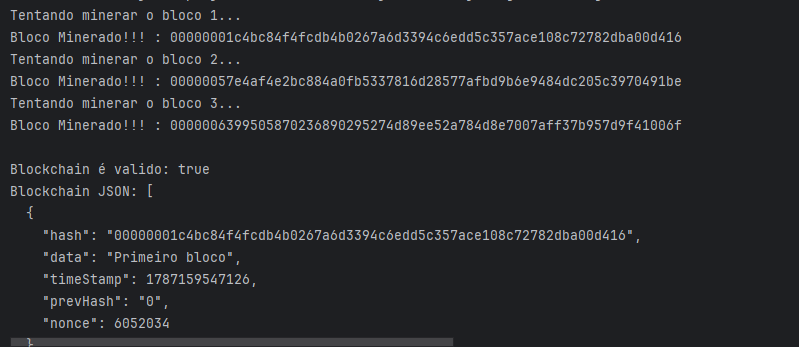
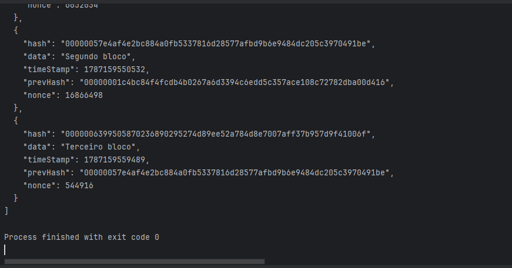

# ⛓️ NoobChain — Blockchain em Java

Projeto desenvolvido para estudar e entender, na prática, os conceitos básicos por trás de uma **Blockchain**, utilizando Java.

A ideia do projeto é construir uma blockchain simples do zero, acompanhando a **Parte 1** do tutorial [Creating Your First Blockchain with Java](https://medium.com/programmers-blockchain/create-simple-blockchain-java-tutorial-from-scratch-6eeed3cb03fa).

> ⚠️ Este projeto possui finalidade educacional e não representa uma implementação de blockchain pronta para uso em produção.

---

## 🎯 Objetivo

O objetivo principal é entender como os principais conceitos de uma blockchain funcionam na prática, implementando cada parte utilizando Java.

Nesta primeira etapa, o projeto trabalha principalmente com:

* criação de blocos;
* conexão entre blocos;
* geração de hashes utilizando SHA-256;
* Proof of Work (PoW);
* mineração de blocos;
* validação da blockchain;
* serialização da blockchain para JSON.

---

## 🧱 Estrutura do projeto

Cada bloco possui informações que permitem conectá-lo ao bloco anterior.

De forma simplificada:

```text
┌──────────────┐
│  Bloco 0     │
│              │
│ Data         │
│ Hash         │
│ Prev. Hash   │
└──────┬───────┘
       │
       ▼
┌──────────────┐
│  Bloco 1     │
│              │
│ Data         │
│ Hash         │
│ Prev. Hash ──┼──► Hash do Bloco 0
└──────┬───────┘
       │
       ▼
┌──────────────┐
│  Bloco 2     │
│              │
│ Data         │
│ Hash         │
│ Prev. Hash ──┼──► Hash do Bloco 1
└──────────────┘
```

O `prevHash` é responsável por criar a ligação entre os blocos.

---

## 🔐 Hash SHA-256

Cada bloco possui um hash calculado a partir das suas informações.

O projeto utiliza o algoritmo **SHA-256** para gerar esse hash.

Uma alteração nos dados do bloco altera seu hash. Isso permite detectar alterações realizadas posteriormente na cadeia.

Exemplo:

```text
Bloco original
       ↓
SHA-256
       ↓
00000e1a0ff577fd9f80cd3e0c2d62f4fe866f649ec6932ed4ed7cc5711f24ba
```

---

## ⛏️ Proof of Work

Nesta etapa também é implementado um sistema simples de **Proof of Work**.

A mineração consiste em encontrar um valor de `nonce` capaz de produzir um hash que atenda à dificuldade definida.

No projeto:

```java
public static int difficulty = 6;
```

Isso significa que o hash minerado precisa começar com:

```text
000000
```

Por exemplo:

```text
000000e1a0ff577fd9f80cd3e0c2d62f4fe866f649ec6932ed4ed7cc5711f24ba
```

O processo pode exigir várias tentativas até encontrar um hash válido.

---

## 🔗 Validação da Blockchain

Depois que os blocos são criados e minerados, a blockchain pode ser verificada.

A validação verifica principalmente:

* se o hash armazenado corresponde ao hash calculado;
* se o bloco está corretamente conectado ao bloco anterior;
* se o hash atende à dificuldade de mineração.

A ideia é detectar possíveis alterações nos dados da cadeia.

---

## 📦 Tecnologias utilizadas

* **Java**
* **SHA-256**
* **Gson**
* **IntelliJ IDEA**
* **JDK 24**

O Gson é utilizado para transformar a blockchain em JSON e facilitar a visualização de sua estrutura.

---

## ▶️ Exemplo de execução

Durante a execução, o programa realiza a mineração dos blocos:





Após a mineração, o programa tenta verificar se a blockchain é válida e exibe sua estrutura em JSON.

---

## 📚 O que estou aprendendo

Com este projeto estou buscando entender, de forma prática:

* como uma blockchain é estruturada;
* como os blocos são conectados;
* como hashes podem ajudar na integridade dos dados;
* como funciona o processo básico de mineração;
* o conceito de Proof of Work;
* como verificar a integridade de uma cadeia de blocos;
* como transformar objetos Java em JSON.

---

## 🚧 Próximos passos

Na **Parte 2** do projeto, o objetivo será evoluir a blockchain para que ela deixe de armazenar apenas mensagens e passe a trabalhar com **transações e transferência de valores**.

Os próximos conceitos que pretendo implementar e estudar são:

* criação de **carteiras (Wallets)**;
* geração de **chaves públicas e privadas** utilizando criptografia de curva elíptica;
* criação e validação de **transações**;
* implementação de **assinaturas digitais**;
* utilização da chave privada para assinar transações;
* utilização da chave pública para verificar a autenticidade das transações;
* implementação de **Transaction Inputs e Transaction Outputs**;
* utilização do modelo **UTXO (Unspent Transaction Output)** para controlar os valores disponíveis;
* cálculo do saldo das carteiras;
* processamento e validação das transações;
* inclusão de múltiplas transações dentro de um bloco;
* utilização do **Merkle Root** para representar as transações do bloco;
* criação do **bloco gênese (Genesis Block)** e distribuição inicial dos NoobCoins;
* atualização da validação da blockchain para considerar também a validade das transações.

Ao final dessa etapa, a NoobChain deverá ser capaz de representar uma pequena criptomoeda experimental, permitindo que carteiras realizem transferências de valores de forma assinada e verificável.

> 💡 A implementação continua tendo finalidade educacional. O objetivo é compreender como esses mecanismos funcionam internamente, e não criar uma criptomoeda pronta para uso real.


---

## 📖 Referência

Projeto baseado no tutorial:

**Creating Your First Blockchain with Java — Part 1**

Autor: Kass

[Tutorial original no Medium](https://medium.com/programmers-blockchain/create-simple-blockchain-java-tutorial-from-scratch-6eeed3cb03fa?utm_source=chatgpt.com)

Também é possível encontrar o projeto original utilizado como referência no GitHub:

[NoobChain Tutorial Part 1 — GitHub](https://github.com/CryptoKass/NoobChain-Tutorial-Part-1?utm_source=chatgpt.com)
